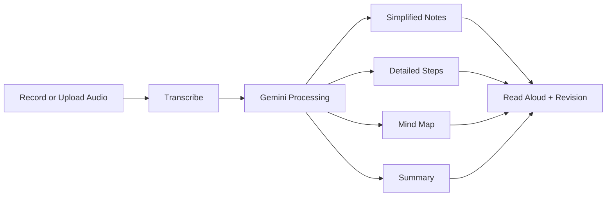
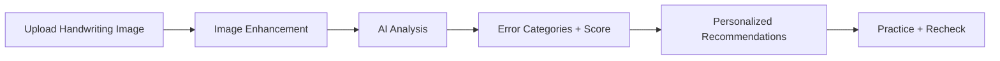
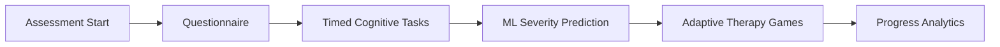

# NeuroLex

### AI Learning Companion for Dyslexia Support

[](https://github.com/pushkarrd/neurolex)
[](frontend-next)
[](backend-python)
[](https://firebase.google.com)
[](https://ai.google.dev)
[](RAILWAY_DEPLOY_CHECKLIST.md)

NeuroLex is an accessibility-first learning platform built for students with dyslexia and reading challenges.
It turns heavy study material into clear, structured, confidence-building learning experiences through AI, adaptive workflows, and assistive design.

## Why NeuroLex Exists

Many students do not struggle with intelligence. They struggle with format, pace, and cognitive load.

NeuroLex helps by making content:
- Easier to read
- Easier to hear
- Easier to practice
- Easier to retain

## What the Prototype Does

### Core capabilities

- Reading assistant with read-aloud and dyslexia-friendly controls
- Lecture-to-learning pipeline with AI-generated study views
- AI handwriting analysis with score and feedback
- Screening assessment with ML-backed severity output
- Therapy games with adaptive difficulty
- Analytics dashboard for progress tracking

### Feature snapshot

| Area | What users get | Powered by |
|---|---|---|
| Reading | TTS, speed controls, syllable support, language switch | Next.js + backend TTS proxy |
| Lecture Intelligence | Transcription, simplified notes, steps, mind map, summary | Gemini 2.5 Flash |
| Handwriting | Error detection, category scoring, recommendations | Gemini Vision + Pillow |
| Assessment | Questionnaire + timed tasks + severity prediction | FastAPI + scikit-learn |
| Therapy Games | 6 cognitive games with progression | Next.js + FastAPI |
| Progress | Charts, activity feed, recommendations | Firestore + Chart.js |

## Product Workflows

### 1) Lecture to study kit



### 2) Handwriting support loop



### 3) Assess to improve



## Architecture at a Glance

```text
frontend-next (Next.js 16)
  -> calls FastAPI backend
backend-python (FastAPI)
  -> Gemini APIs (text + vision)
  -> Firebase Admin (Firestore)
  -> ML severity model (scikit-learn)
Firestore
  -> lectures, assessments, game sessions, progress
```

## Repository Layout

```text
Dyslexia-Assist/
|- backend-python/      FastAPI APIs, ML model, AI processing
|- frontend-next/       Next.js frontend application
|- railway.json         Railway build and start config
|- RAILWAY_DEPLOY_CHECKLIST.md
```

## Quick Start

### Prerequisites

- Node.js 18 or newer
- Python 3.10 or newer
- Firebase project (Auth + Firestore)
- Gemini API key

### 1) Frontend

```bash
cd frontend-next
npm install
npm run dev
```

Frontend runs on http://localhost:3000

### 2) Backend

```bash
cd backend-python
pip install -r requirements.txt
uvicorn main:app --reload --port 8001
```

Backend runs on http://localhost:8001

## Environment Variables

### Frontend file: frontend-next/.env.local

```env
NEXT_PUBLIC_FIREBASE_API_KEY=
NEXT_PUBLIC_FIREBASE_AUTH_DOMAIN=
NEXT_PUBLIC_FIREBASE_PROJECT_ID=
NEXT_PUBLIC_FIREBASE_STORAGE_BUCKET=
NEXT_PUBLIC_FIREBASE_MESSAGING_SENDER_ID=
NEXT_PUBLIC_FIREBASE_APP_ID=
NEXT_PUBLIC_GOOGLE_CLIENT_ID=
NEXT_PUBLIC_BACKEND_URL=http://localhost:8001
```

### Backend file: backend-python/.env

```env
GEMINI_API_KEY=
FIREBASE_SERVICE_ACCOUNT_PATH=./serviceAccountKey.json
FIREBASE_SERVICE_ACCOUNT_JSON=
ASSEMBLYAI_API_KEY=
```

Railway recommendation:
- Set FIREBASE_SERVICE_ACCOUNT_JSON in Railway variables instead of shipping key files.

## Deploy on Railway

This repo already includes railway.json for backend deployment.

Start command:

```bash
cd backend-python && uvicorn main:app --host 0.0.0.0 --port $PORT
```

For full deployment checks, follow:
- RAILWAY_DEPLOY_CHECKLIST.md

## API Highlights

| Group | Endpoint |
|---|---|
| Health | GET /health |
| Lectures | POST /api/lectures |
| Content Transform | POST /api/content/transform |
| Handwriting | POST /api/handwriting/analyze |
| Assessment | GET /assessment/start, POST /assessment/submit |
| Games | POST /api/games/session/start |
| TTS | POST /api/tts/synthesize |

## Prototype Goals

- Reduce reading friction for dyslexic learners
- Increase clarity and retention through multi-format content
- Build confidence with practical daily therapy loops
- Give caregivers and educators visible progress signals

## Security and Privacy Notes

- Never commit service account keys or env files
- Prefer platform environment variables for secrets
- Rotate credentials immediately if exposure is suspected

## Team

Built by the NeuroLex team with a student-first accessibility mindset.
